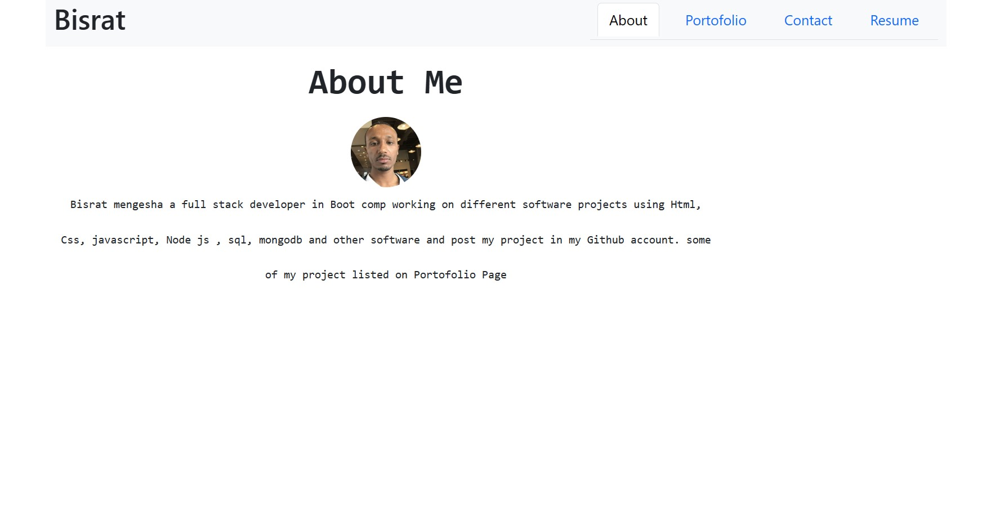
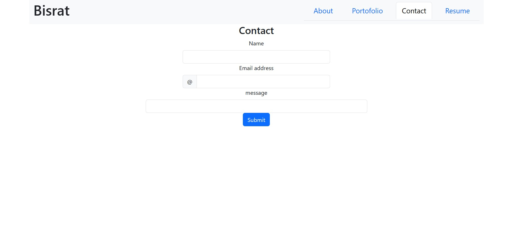
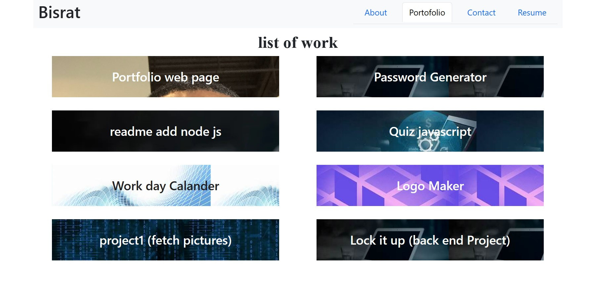
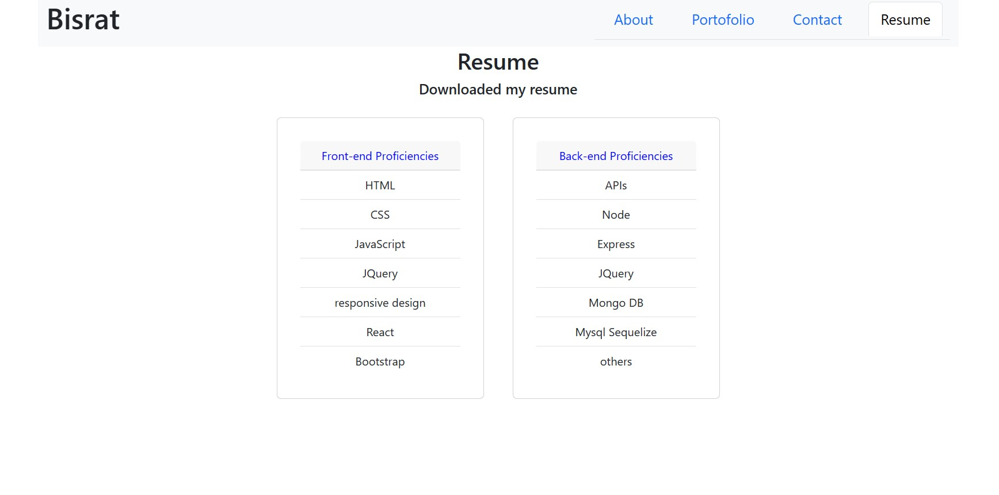

# porofolioreact
<bisrat mengesha>

 # this project bult portofolio using react js

 # i use different package like router icon 

 # boot strap used for css

 i have component of navbar and footer displayed all the time

 each component page pictures are displayed

 
 
 
 

repo link https://github.com/Hellobisrat/porofolioreact.git

deploy link https://tubular-eclair-a48831.netlify.app